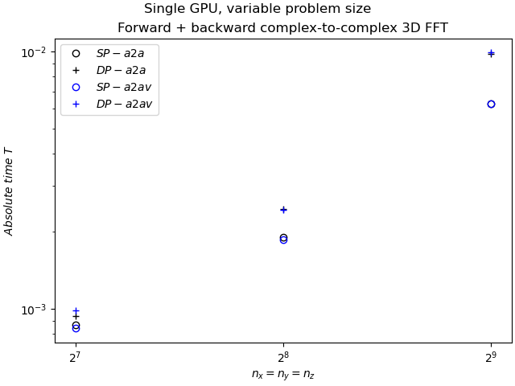
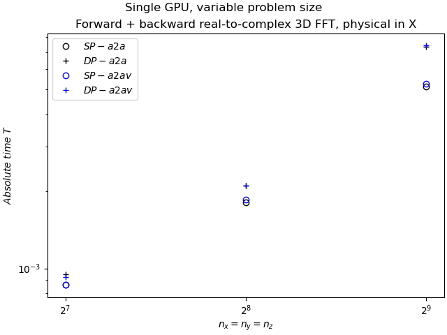
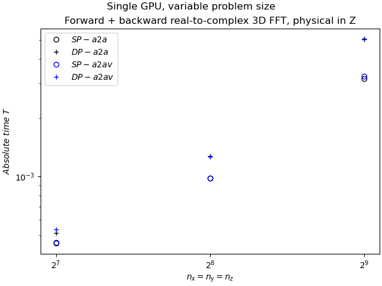
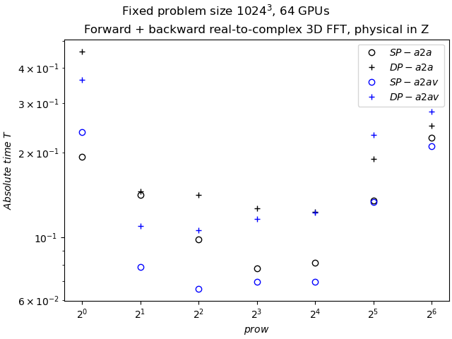
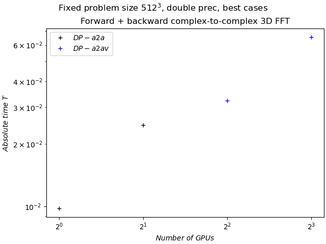
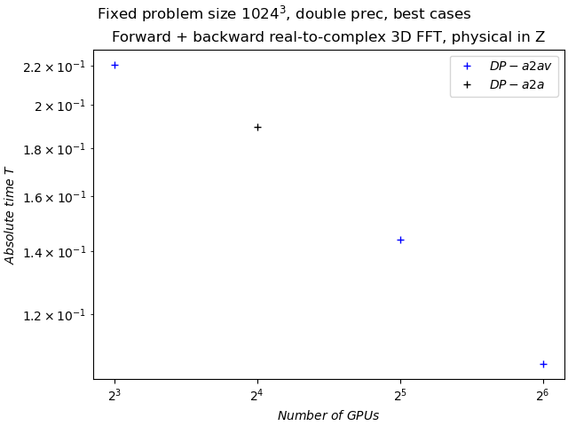

# 2DECOMP&FFT: Scalability tests performed on Jean Zay

The following tests were performed on the machine Jean Zay using 2decomp&FFT version 2.2 alpha :

- [3D R2C FFT ](https://github.com/2decomp-fft/2decomp-fft/blob/v2.1/examples/fft_physical_x/README.md) starting from a X-pencil decomposition
- [3D C2C FFT ](https://github.com/2decomp-fft/2decomp-fft/blob/v2.1/examples/fft_physical_x/README.md) starting from a X-pencil decomposition
- [3D R2C FFT ](https://github.com/2decomp-fft/2decomp-fft/blob/v2.1/examples/fft_physical_z/README.md) starting from a Z-pencil decomposition

The tests were performed in single precision and double precision using CUDA-aware MPI_ALLTOALL and CUDA-aware MPI_ALLTOALLV.
Each test was performed one time to initialize the memory and then 100 times to measure the average performance.
The partition H100 contains 364 nodes, each with 4 GPU NVIDIA H100 SXM5 80 Go.

## Building 2DECOMP&FFT:

The build script below provides the version number for the compiler and the libraries.
```
#!/usr/bin/env bash
module load arch/h100
module load nvidia-compilers/26.3
module load cuda/12.8.0
module load openmpi/4.1.8-cuda
module load cmake/3.31.4
rm -rf ./build_caliper_static/
FC=mpif90 CC=mpicc cmake -S . -B build_caliper_static -DBUILD_SHARED_LIBS=off -DCMAKE_BUILD_TYPE=dev -DBUILD_TESTING=ON -DBUILD_TARGET=gpu -DENABLE_NCCL=no -DSET_CUDA_ARCH=90 -DCOMPLEX_TESTS=OFF -DDOUBLE_PRECISION=ON -DENABLE_INPLACE=ON -DENABLE_PROFILER=caliper -Dcaliper_DIR=xxxxxxxxx
FC=mpif90 CC=mpicc cmake --build build_caliper_static --verbose
FC=mpif90 CC=mpicc cmake --install build_caliper_static
```

## Running the tests

Most of the tests, when completed, submit a job for the next one.
The script `run.sh`, available in each case, can be used to run all the tests associated with a case.

## Processing the tests

The python script `process.py` available in the present folder can process the dataset and analyse the performance.

# Results of the test

## Tests on a single GPU

For grids 128^3, 256^3 and 512^3 show a simple trend : the higher the number of cells, the longer it takes to run the test.







## Impact of the pencil decomposition

Tests on 64 GPUs with the grid 1024^3 illustrate the critical impact of the pencil decomposition on the performance.
Pencil decomposition with 4 GPUs in a row or column can perform better because each node has 4 GPUs.
However, this general observation is not always accurate.
Each application using 2DECOMP&FFT should analyse carefully their workflow and adapt their pencil decomposition accordingly.



## Strong scaling

### Small number of GPUs and small grids

The strong scaling for a grid 512^3 with up to 2 nodes (8 GPUs) is not very good.
The NCCL backend might improve the performance.



### Large number of GPUs and large grids

The strong scaling for a larger grid (1024^3) using 2 to 16 nodes is more interesting.


